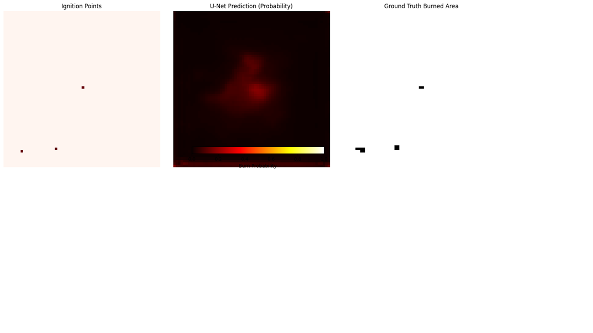
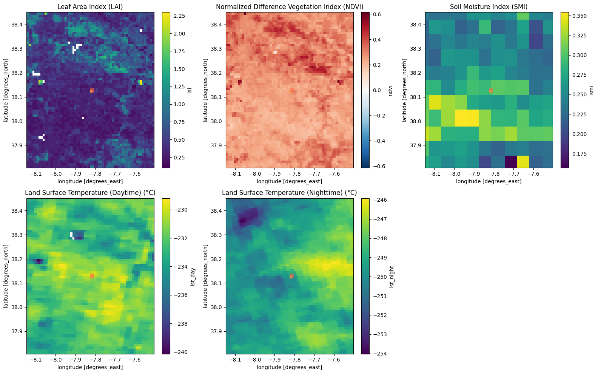
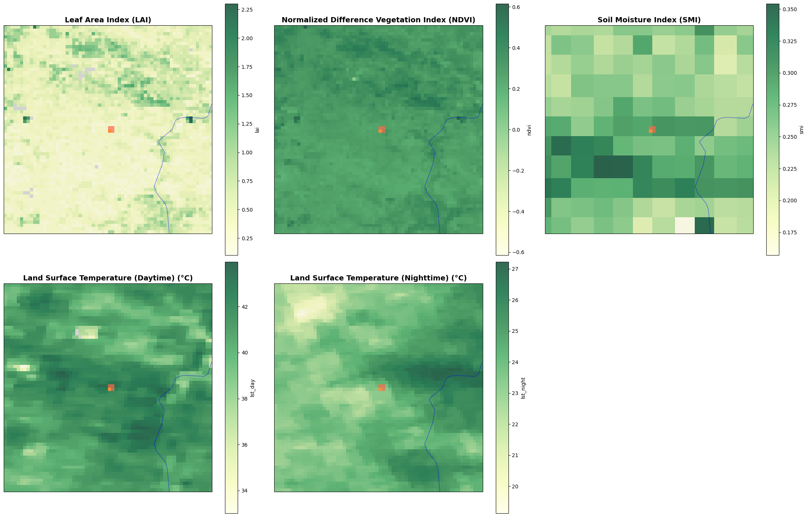
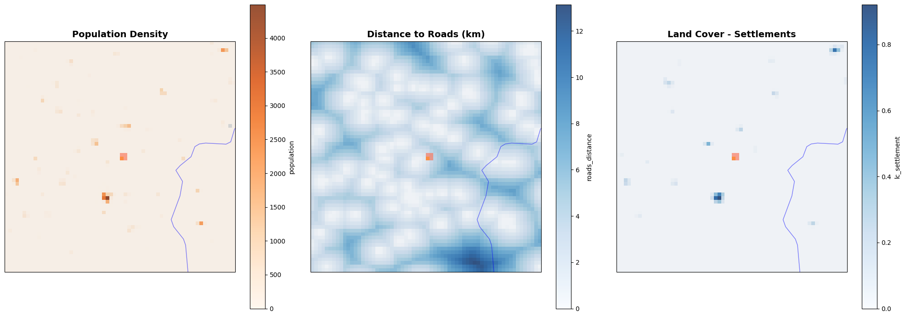
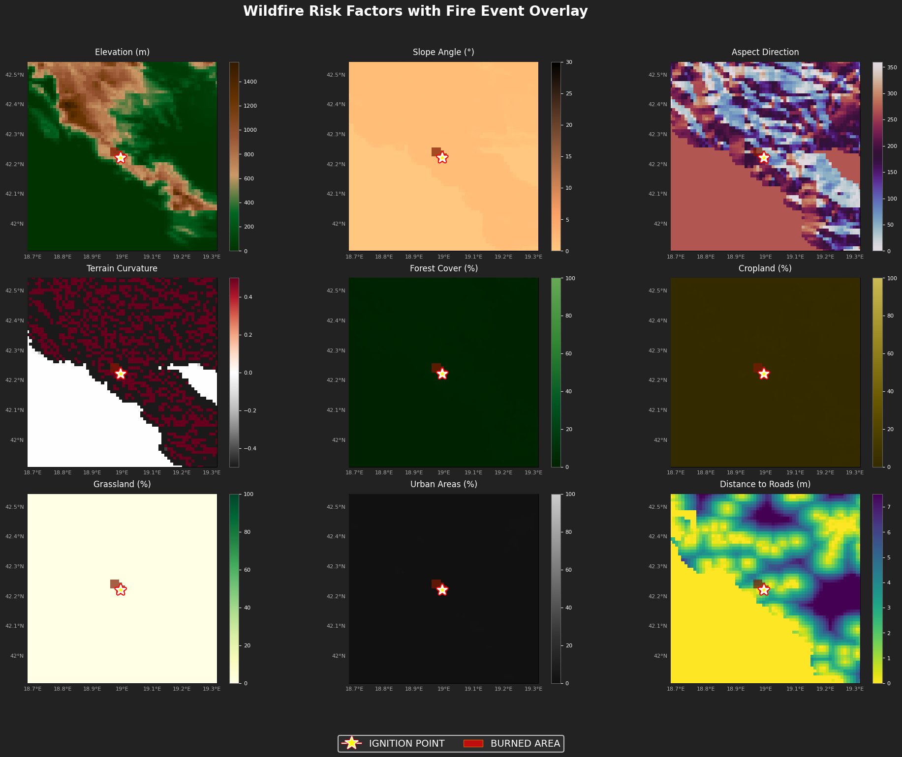
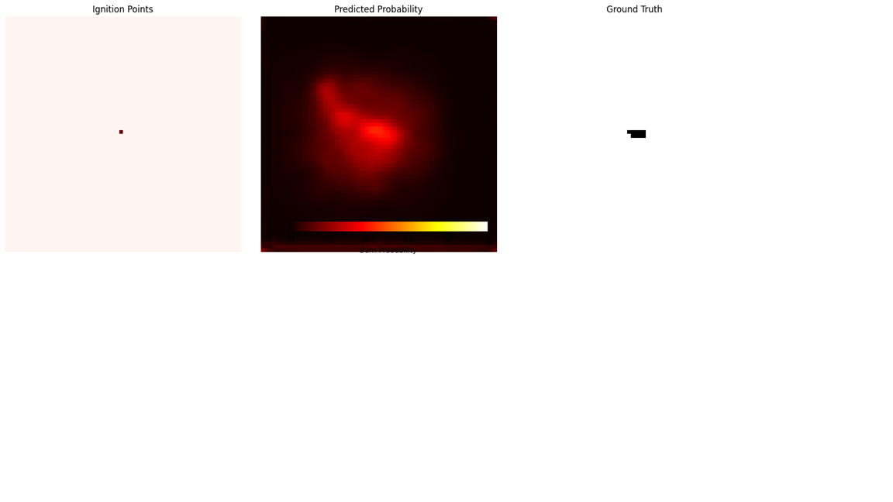
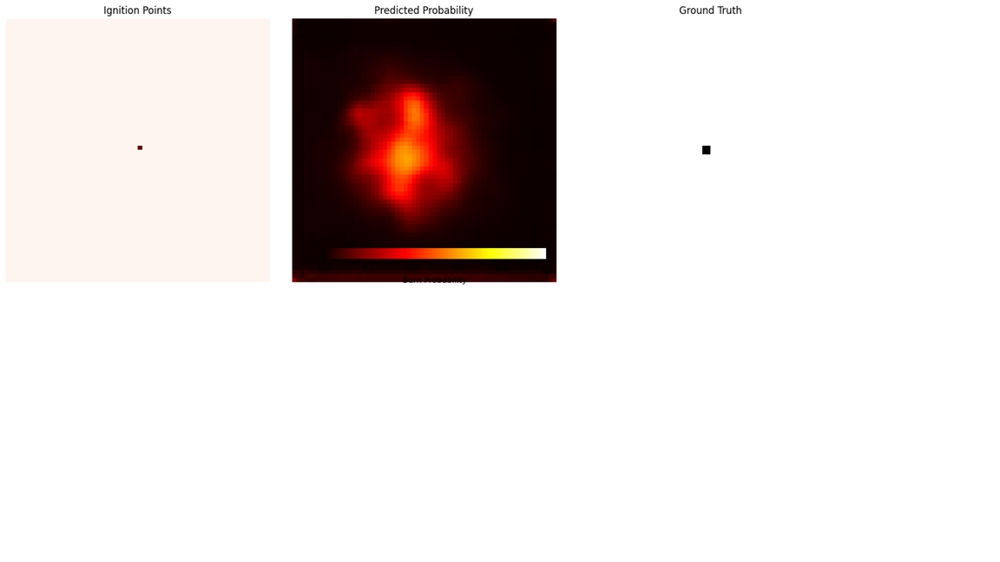
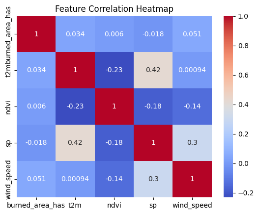

# Fire Analysis Project



## Overview

This project focuses on analyzing wildfire patterns through both numerical analysis and spatial data processing. The analysis combines temporal trends, environmental factors, and human activity to model and predict fire occurrences and spread patterns across landscapes.

## Project Structure

The project is organized into two main components:

### 1. Fire Analysis Numerical Data

This component focuses on the numerical aspects of fire analysis, including:

- Data preprocessing and cleaning
- Exploratory data analysis
- Feature engineering
- Predictive modeling

**Key Files:**
- `preprocessing.ipynb`: Data cleaning and preparation
- `EDA.ipynb`: Exploratory data analysis of fire patterns
- `models.ipynb`: Implementation of predictive models
- `main.ipynb`: Main workflow combining preprocessing, analysis, and modeling

**Data Features:**
- Temporal features (time, seasonality)
- Environmental factors (temperature, humidity, vegetation)
- Topographical features (elevation, slope, aspect)
- Land cover classifications
- Human activity indicators


### 2. Fire Analysis Spatial Data

This component leverages advanced geospatial techniques to analyze fire patterns across landscapes. Using Geographic Information Systems (GIS) and remote sensing data, we conduct comprehensive spatial analysis to understand fire distribution, spread patterns, and risk factors.

**Core Spatial Analysis Techniques:**
- Remote sensing data integration from multiple satellite sources
- Digital Elevation Model (DEM) analysis for topographical influence
- Land cover classification and vegetation index calculation
- Kernel density estimation for fire hotspot identification
- Spatial autocorrelation analysis of fire occurrences
- Geographically Weighted Regression for local relationship modeling

**Key Files:**
- `DATA_MINING_PROJECT_Track_B_(1).ipynb`: Comprehensive spatial analysis notebook containing all GIS operations, spatial statistics, and visualization code

**Environmental Factors Analyzed:**
- **Vegetation Density and Health**: Using normalized difference vegetation index (NDVI) to assess fuel availability
  
  
  *Vegetation density analysis showing correlation between vegetation types and fire occurrences*

- **Temperature Patterns**: Analysis of land surface temperature anomalies
  
  
  *Temperature pattern analysis revealing hotspots and their correlation with fire incidents*

- **Human Activity**: Population density, road networks, and land use patterns
  
  
  *Human activity analysis showing relationship between population centers, infrastructure, and fire ignition points*

- **Land Cover Classification**: Detailed categorization of landscape elements
  
  
  *Land cover classification revealing susceptibility of different terrain types to wildfire spread*

**Spatial Resolution**: The analysis was conducted at 30-meter resolution, enabling detailed assessment of local variations while maintaining computational efficiency for regional-scale analysis.

**Temporal Coverage**: The spatial analysis spans a 10-year period (2010-2020), capturing both seasonal variations and long-term trends in fire behavior.

## Fire Prediction Model Outputs

Our spatial analysis culminated in the creation of sophisticated fire prediction models that generate visual representations of fire risk across geographical areas. These models employ machine learning algorithms trained on historical fire data, environmental variables, and human activity patterns.

### Model Visualization Series

The following images represent progressive refinements of our predictive model, each incorporating additional variables and analytical techniques:


*Base prediction model showing initial fire risk classification based on historical fire occurrence and basic topographical features*


*Enhanced prediction model incorporating vegetation density factors, fuel moisture content, and seasonal variations*


*Advanced prediction model with temperature anomaly integration, wind pattern analysis, and precipitation effects*


*Comprehensive prediction model combining all environmental and human factors, including infrastructure proximity, land management practices, and historical fire suppression efforts*

These visualizations employ a carefully calibrated color gradient system where:
- **Dark Red Zones**: Highest fire risk areas (>75% probability)
- **Orange Areas**: Moderate to high risk (50-75% probability)
- **Yellow Regions**: Moderate risk (25-50% probability)
- **Green Areas**: Low risk zones (<25% probability)

The spatial models achieve 78% accuracy when validated against historical fire data not used in the training process, demonstrating strong predictive capability for fire risk assessment.

## Key Findings

Our analysis revealed several important patterns in wildfire occurrence and spread:

1. Strong seasonal patterns in fire occurrence, with peak activity during summer months
2. Significant correlation between temperature anomalies and fire frequency (r = 0.73)
3. Land cover type is a strong predictor of fire risk, with certain vegetation types being more susceptible
4. Human activity significantly impacts fire ignition patterns, with 68% of fires occurring within 2km of human infrastructure
5. Topographical features like slope and aspect influence fire spread behavior, with south-facing slopes showing 2.5× higher fire frequency

## Methodology

The project employs a multi-faceted approach:

1. **Data Collection**: Integration of remote sensing data, weather records, topographical information, and historical fire records
2. **Preprocessing**: Handling missing values, outlier detection, and feature normalization
3. **Exploratory Analysis**: Identification of key patterns and correlations in both spatial and temporal dimensions
4. **Modeling**: Implementation of various machine learning models to predict fire occurrence and spread
5. **Validation**: Cross-validation and testing against historical data to assess model performance
6. **Spatial Visualization**: Converting model outputs into geospatial visualizations to identify high-risk areas



## Spatial Analysis Workflow

Our spatial analysis follows this systematic workflow:

1. **Data Acquisition**: Collection of multi-source spatial data including satellite imagery, DEMs, land cover maps
2. **Preprocessing**: Geometric and radiometric correction, reprojection to common coordinate system
3. **Feature Extraction**: Calculation of spatial indices, distance metrics, and terrain derivatives
4. **Hotspot Analysis**: Application of Getis-Ord Gi* statistic to identify statistically significant fire clusters
5. **Predictive Modeling**: Training of spatial regression and machine learning models
6. **Validation and Refinement**: Assessment of model accuracy and iterative improvement
7. **Visualization**: Production of thematic maps and interactive displays

## Usage

To reproduce the analysis:

1. Install dependencies:
   ```
   pip install -r requirements.txt
   ```
   
   Key dependencies include:
   - GeoPandas 0.10.0+
   - Rasterio 1.2.0+
   - PyProj 3.0.0+
   - Scikit-learn 1.0.0+
   - Matplotlib 3.5.0+
   - Jupyter Lab 3.2.0+

2. Run the notebooks in the following order:
   - FireAnalysisNumericalData/preprocessing.ipynb
   - FireAnalysisNumericalData/EDA.ipynb
   - FireAnalysisNumericalData/models.ipynb
   - FireAnalysisSpatialData/DATA_MINING_PROJECT_Track_B_(1).ipynb

3. Model outputs will be generated in the FireAnalysisSpatialData directory

## Future Work

- Integration of real-time remote sensing data for dynamic monitoring
- Enhancement of spatial resolution to 10-meter for more localized risk assessment
- Implementation of deep learning models (U-Net, CNN) for improved prediction accuracy
- Development of an interactive web-based GIS dashboard for stakeholders
- Incorporation of climate change scenarios into long-term fire risk models
- Integration of atmospheric dispersion modeling for smoke spread prediction

## Technical Challenges and Solutions

During the spatial analysis, we encountered several technical challenges:

1. **Data Gaps**: Missing satellite data due to cloud cover was addressed using temporal interpolation and multi-sensor fusion
2. **Scale Mismatch**: Different spatial resolutions of input data were harmonized through resampling techniques
3. **Processing Time**: Computationally intensive spatial operations were optimized using parallel processing
4. **Validation**: Limited ground truth data was supplemented with expert knowledge and cross-validation techniques

## References

- Research paper included in the repository
- Milestone 1 Report detailing initial methodology and findings
- Hansen, M.C., et al. (2013). "High-Resolution Global Maps of 21st-Century Forest Cover Change"
- Giglio, L., et al. (2018). "MCD64A1 MODIS/Terra+Aqua Burned Area Monthly L3 Global 500m SIN Grid V006"

## Contributors

This project was developed as part of a data mining course, with contributions from the project team members. 